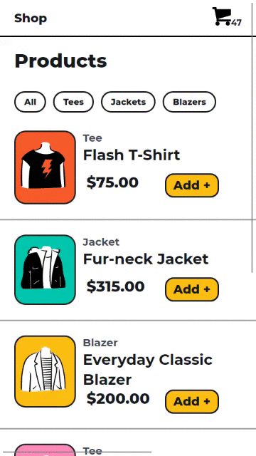

# E-Shop

- Mobile First E-commerce web application.

# Color

```scss
$black : #18191F;
$white : #FFFFFF;
$primary-color: #1947E5;
$secondary-color: #FFBD12;
$third-color: #FFC7DE;
$fifth-color: #E9E7FC;
```
# Design 

<p align="center">
  
</p>


# FrontEnd 

- In the code root directory `eshop`
- First Install dependencies.

```bash
npm install
```

- Start Dev Server at URL : `http://localhost:9000/`

```bash
npm run start:dev
```

- Build to exported optimized file. 

```bash
npm run build
```

# Backend

- On new terminal go to `backend` folder from root directory of project and start REST API server for products data
- First Install dependencies.

```bash
npm install
```
- Start Backend server at URL : `http://localhost:2020/`


```bash
npm run start
```

# Customize

- To change the backend URL look for `config.js` file inside `src/modules/config.js`

```js
const rootURL = 'http://localhost:2020';

const config = {
    rootURL: rootURL,
    productURL: `${rootURL}/product/`,
    orderURL: `${rootURL}/order/`
}

```
- To change the Frontend URL look for `webpack.config.js` in root directory of repository.

```js
devServer: {
        contentBase: path.join(__dirname, "dist"),
        port: 9000
    },
```
